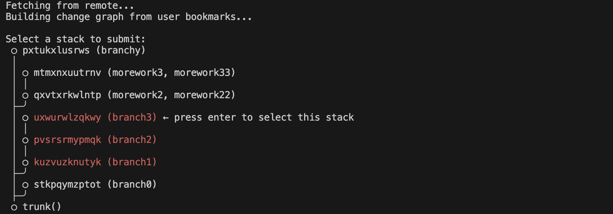
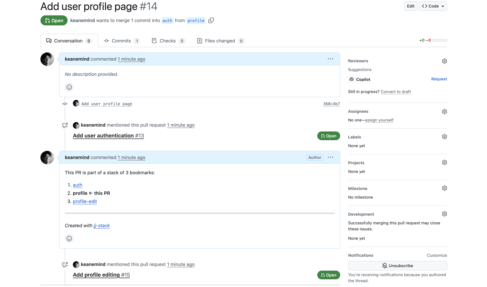

# jj-stack

A CLI tool for creating and managing stacked pull requests on GitHub when using Jujutsu locally.



> **Note:** The command can be run as either `jst` (recommended) or `jj-stack`. Examples below use `jst`.

## How it works

The tool leverages Jujutsu's bookmark system to understand the structure of your stacked changes. It:

1. Analyzes your local bookmarks using `jj bookmark list` and `jj log`
2. Builds a graph of how bookmarks are stacked on top of each other
3. Uses this information to create properly linked pull requests on GitHub
4. Sets the correct base branch for each PR based on the stacking relationship

Unlike analogous tools for Git, jj-stack is much simpler because it is not an abstraction over jj and does not help you manipulate your local repository. Jujutsu's CLI is already very ergonomic for managing stacks locally, so jj-stack specifically focuses on taking your local repo state and turning it into GitHub pull requests.

## Requirements

- Node.js 18.3.0+
- Jujutsu (jj) version 0.30.0 or later
- Git repository with GitHub remote
- GitHub authentication (multiple methods supported)

## Setup

### Installation

Install jj-stack globally using npm:

```bash
npm install -g jj-stack
```

After installation, the `jst` and `jj-stack` commands will be available globally.

<details>
<summary> If you prefer to build from source instead of using npm </summary>

1. Clone the repository:

   ```bash
   git clone https://github.com/keanemind/jj-stack.git
   cd jj-stack
   ```

2. Install dependencies:

   ```bash
   npm install
   ```

3. Build the project:

   ```bash
   npm run build
   ```

4. Make the CLI available globally:

   ```bash
   npm link
   ```

   Or run directly with:

   ```bash
   node dist/index.js
   ```

</details>

### Authentication

Set up GitHub authentication:

jj-stack supports multiple authentication methods (in priority order):

**Option 1: GitHub CLI (Recommended) ⭐**

```bash
# Install GitHub CLI if not already installed
brew install gh  # macOS
# or visit https://cli.github.com/

# Authenticate with GitHub
gh auth login

# That's it! jj-stack will automatically use your GitHub CLI auth
```

**Option 2: Environment Variable**

```bash
export GITHUB_TOKEN="your_github_personal_access_token"
# or
export GH_TOKEN="your_github_personal_access_token"
```

**Creating a Personal Access Token:**

- Go to https://github.com/settings/tokens/new
- Required scopes: `repo` (includes pull request access)

**Test your authentication:**

```bash
jst auth test
```

For more details, see [AUTHENTICATION.md](./AUTHENTICATION.md)

## Environment Variables

- `GITHUB_TOKEN` or `GH_TOKEN` (optional): Your GitHub personal access token
- `GITHUB_OWNER` (optional): Override auto-detected repository owner
- `GITHUB_REPO` (optional): Override auto-detected repository name
- `JJ_PATH` (optional): Custom path to jj executable

## Getting started

First, make sure your repo has at least one remote with either a `main`, `master`, or `trunk` branch. That branch will be referred to as `trunk()`, because that's the [Jujutsu revset](https://jj-vcs.github.io/jj/latest/revsets/) jj-stack uses to find it.

Create changes locally as you work. You can create bookmarks as you go based on how you want changes grouped into PRs, or defer that decision and add all the bookmarks at the end. If there are multiple changes between two bookmarks, those changes will go into the same PR.

```bash
jj new main -m "Add user authentication"
jj bookmark create auth --revision @
# Do some work

jj new -m "Add user profile page"
jj bookmark create profile --revision @
# Do some more work

jj new -m "Add profile editing"
jj bookmark create profile-edit --revision @
# Do some more work
```

```bash
jj log
@  tnosltrr yourname@example.com 2025-06-22 10:08:32 profile-edit 4098fe71
│  (empty) Add profile editing
○  muozxulo yourname@example.com 2025-06-22 10:08:22 profile 368c4b72
│  (empty) Add user profile page
○  ytpxqlll yourname@example.com 2025-06-22 10:07:43 auth 16856954
│  (empty) Add user authentication
◆  orzzzyxs yourname@example.com 2025-06-21 10:21:06 main 475be5d9
│  more work 1 (#10)
~
```

Now use jj-stack to turn these bookmarks into PRs on GitHub.

```bash
# Submit bookmarks downstack from the top
jst submit profile-edit
# Creates PRs: auth -> main, profile -> auth, profile-edit -> profile

# Or submit starting from any point in the stack
jst submit profile
# Creates PRs: auth -> main, profile -> auth
```



Now you can merge the PR closest to `trunk()`, `auth`. After merging, you need to update upstack PRs.

Using Jujutsu, abandon the changes that were in your merged PR. If you deleted the branch from your remote after merging the PR, your corresponding local branch will be deleted once you run `jj git fetch`. In that case, it's easiest to abandon the changes _before_ running `jj git fetch`, while you still have the bookmark locally.

```bash
jj abandon main..auth
```

Now fetch the latest changes to `trunk()`, including your newly-merged change.

```bash
jj git fetch
```

Now rebase your remaining upstack bookmarks on the latest `trunk()`.

```bash
jj rebase -b profile-edit -d "trunk()"
```

Since your local changes are now updated, they need to be pushed to remote and the corresopnding PRs updated. Use jj-stack to do this.

```bash
jst submit profile-edit
```

And so on and so forth!

## Usage

### Default Command

```bash
# Display the current bookmark stacks and change graph
jst
```

Running `jst` without any arguments will:

- Fetch from the remote repository
- Build a graph of your bookmarked changes
- Display an interactive visualization of stacked bookmarks
- Allow you to select a bookmark to submit directly from the graph

### Authentication Commands

```bash
# Test your current authentication setup
jst auth test

# Show authentication help
jst auth help
```

### Submit a stack of bookmarks as PRs

```bash
jst submit <bookmark-name> [--dry-run]
```

This command submits the specified bookmark and all bookmarks below it (downstack toward trunk) as pull requests.

#### Normal Mode

```bash
jst submit my-feature
```

This command will:

1. Validate that the bookmark exists locally
1. Infer the bookmark stack by traversing from your specified bookmark toward `trunk()`
1. Determine if each bookmark needs to be pushed to remote
1. Look for open PRs for each bookmark
1. Determine base branch for each PR:
   - If the bookmark is stacked on another bookmark, use that as the base
   - Otherwise, use `main`, `master`, or `trunk` (in descending priority order) as the base branch
1. Push bookmarks to the remote repository
1. Create PRs that don't exist yet, and update the base of PRs that have an out of date base
   - Each PR's title will be the first line of the description of the change the bookmark points to; that's the latest change on the Git branch
1. Add or update comments on each PR to help reviewers navigate the stack

#### Dry Run Mode

Use `--dry-run` to simulate the entire process without making any changes:

```bash
jst submit my-feature --dry-run
```

This will output a plan of what would be done in normal mode, without actually executing the plan.

## See also

- https://github.com/sunshowers/spr
  - Only lets you have one commit per PR.
- https://github.com/lazywei/fj
  - Only lets you have one commit per PR. Doesn't support updating the bases of existing PRs after shuffling bookmarks around.
